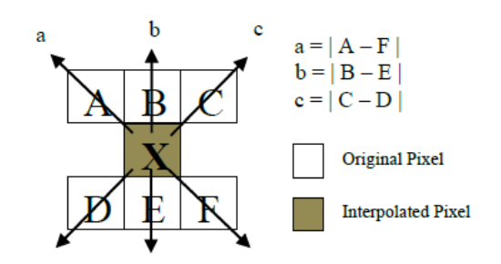
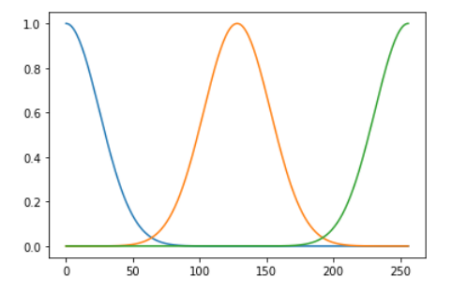
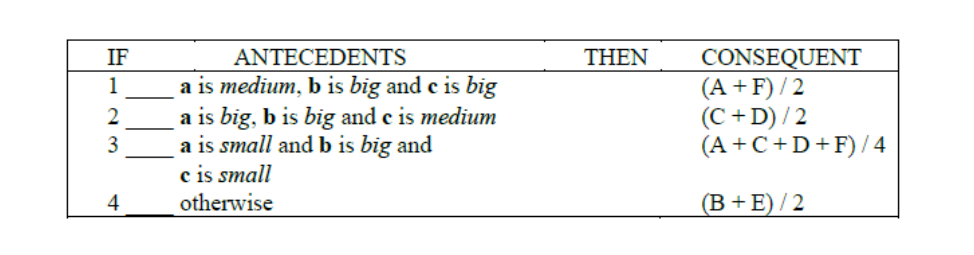
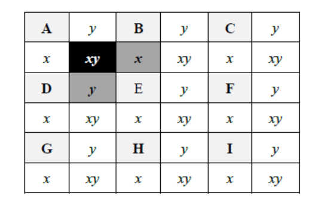
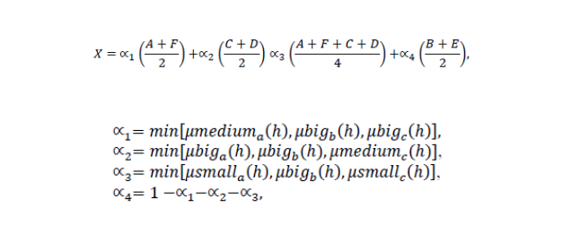

# Edge-based Line Average (ELA) Algorithm

## Introduction
This repository contains a practical implementation of the **Edge-based Line Average (ELA) Algorithm**, derived from research in the field of using AI for image processing. The aim of this project is to provide a successful and practical application of the ELA algorithm, which enhances image resolution by preserving edges and maintaining color consistency. Contributions to improve and expand this implementation are welcome. You can find the original research [here](https://www.researchgate.net/publication/339208030_Fuzzy_Logic_Applied_to_Improvement_of_Image_Resolution_using_Gaussian_Membership_Functions).

## Algorithm Description

The **Edge-based Line Average (ELA) Algorithm** relies on using linear interpolation to find the appropriate pixel value by applying fuzzy rules to its fuzzy variables, which represent the output image.

### Input
The input consists of the pixels surrounding the current pixel. Each surrounding pixel is represented as a fuzzy variable with a fuzzy set characterized by a Gaussian membership function level, which represents the intensity of the pixel (the amount of density). There are 3 levels:
1. **Small**
2. **Medium**
3. **Big**

### Output
The output is the density of the current pixel.

### Algorithm
ELA is an algorithm that performs linear interpolation for the pixels based on rules, with its input being the neighboring pixels.

- The rules aim to preserve the edges and their directions by predicting the pixel value using the known neighboring pixels.
- It also maintains color consistency in areas of the image with small color variations by predicting a pixel with an appropriate color gradient.

### Fuzzy Rules

The variables **a**, **b**, and **c** represent the input variables for the rules. They are the brightness differences between each pair of pixels in opposite directions from the pixel to be predicted.

Fuzzification is performed on the variables **a**, **b**, and **c** according to the Gaussian membership function.

1. **Image Enlargement**:
   - First, the image is enlarged (doubling the length and width).
   - The remaining pixels result from the increased resolution of the image and need their values assigned.
   
2. **ELA Algorithm Application**:
   - To apply the ELA algorithm, we need 6 surrounding pixels from the previously mentioned example to calculate **a**, **b**, and **c** and apply the rules.
   - The unknown value pixels can be classified into three categories:
     - **x**: The group of pixels with known value pixels above and below them (as shown in the figure). Here, the 6 input pixels for the dark gray pixel **x** are represented by {A, B, C, D, E, F}.
     - **y**: The group of unknown value pixels with known value pixels to their left and right (as shown in the figure). Here, the 6 input pixels for the dark gray pixel **y** are represented by {A, B, C, D, E, F}.
     - **xy**: The group of pixels that do not meet the conditions of either **x** or **y**. Here, the 6 input pixels for the black pixels **xy** (according to the figure) are represented by {A, x, B, D, x, E} or {A, y, B, D, y, E}.

4. **Defuzzification Equation**:

5. **Algorithm Application**:
   - The algorithm is applied to all unknown value pixels. The output of the algorithm is the result of the defuzzification of the previous rules.

- **Input**:
- 
- **Result**:
- 

## Contribution
Contributions to this project are welcome. Feel free to open issues or submit pull requests to enhance the algorithm, fix bugs, or improve documentation. Your collaboration will help make this implementation more robust and versatile for various image processing applications.
